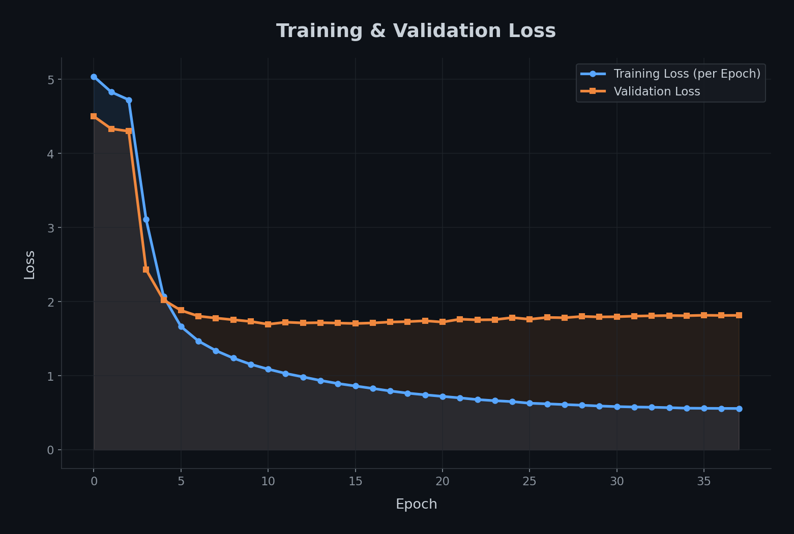
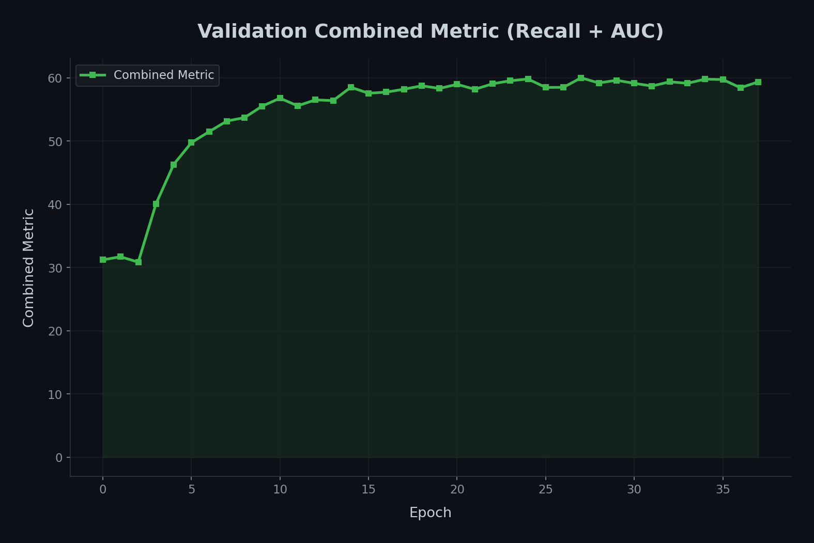
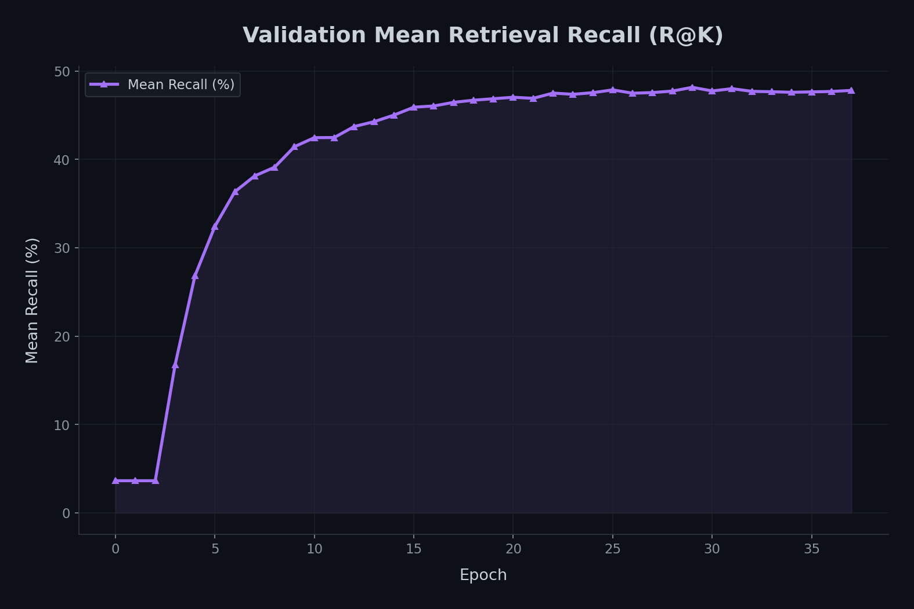
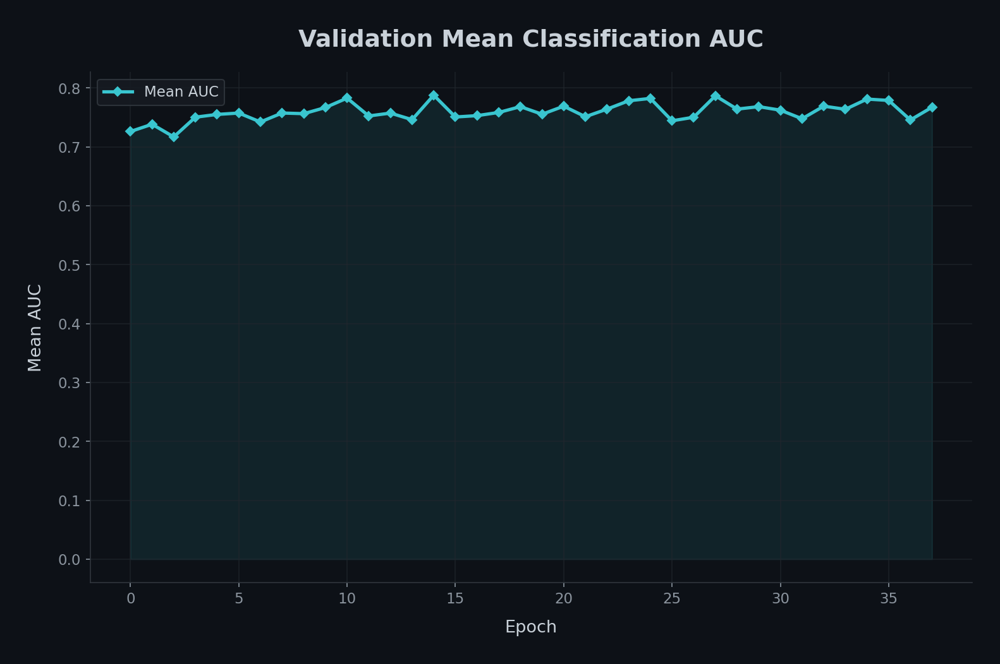

# Patch-IB-CXR: Vision-Language Alignment on Chest X-Rays

This repository implements a Patch-based Information Bottleneck (IB) approach for medical image-text retrieval using the MIMIC-CXR dataset. This project explores staged training and local-global alignment to improve clinical feature representation.

---

## 📍 Table of Contents

- [⚙️ Reproducibility & Environment](#-reproducibility--environment)
- [📊 Dataset Analysis & Generation Logic](#-dataset-analysis--generation-logic)
- [📈 Dataset Distribution & Statistics](#-dataset-distribution--statistics)
- [⚙️ Data Generation Pipeline](#-data-generation-pipeline)
- [🏆 Benchmarking & SOTA Comparison](#-benchmarking--sota-comparison)
- [🧬 Foundation Model](#-foundation-model)
- [🧠 Models](#-models)

---

## ⚙️ Reproducibility & Environment

Experiments are conducted in a containerized environment to ensure consistency.

### 🐳 Docker Configuration

- **Image ID**: `patch_ib_img2:latest` (85ae3bd4da58)
- **Base OS**: Ubuntu 22.04 LTS
- **CUDA Version**: `12.2.0`

### 📦 Core Dependencies

| Library           | Version  |
| :---------------- | :------- |
| `torch`           | `2.10.0` |
| `transformers`    | `4.57.6` |
| `open_clip_torch` | `3.2.0`  |
| `tokenizers`      | `0.22.2` |

### Hardware Utilization

- **VRAM**: RTX 3090 ~24GB
- **Shared Memory**: 8GB `--shm-size`

---

# 📊 Dataset Analysis & Generation Logic

The final dataset, `mimic_master_official_split.jsonl`, represents the transition from limited "Bag-of-Words" labels to a full-scale Vision-Language corpus. By extracting raw radiology narratives and aligning them with the official benchmark, we have eliminated the data duplication issues found in previous versions.

---

## 📈 Dataset Distribution & Statistics

The following table summarizes the final distribution of the **218,138 frontal images** across the official, patient-disjoint partitions.

| Pathology                  |    Train    |    Val    |   Test    |
| :------------------------- | :---------: | :-------: | :-------: |
| **Total Samples**          | **213,364** | **1,733** | **3,041** |
| Atelectasis                |   43,179    |    347    |    679    |
| Cardiomegaly               |   41,735    |    363    |    808    |
| Consolidation              |   10,053    |    76     |    191    |
| Edema                      |   25,472    |    233    |    659    |
| Enlarged Cardiomediastinum |    6,681    |    53     |    132    |
| Fracture                   |    4,111    |    17     |    78     |
| Lung Lesion                |    5,766    |    64     |    108    |
| Lung Opacity               |   48,097    |    373    |    974    |
| No Finding                 |   71,202    |    561    |    539    |
| Pleural Effusion           |   50,720    |    452    |    990    |
| Pleural Other              |    1,814    |    14     |    52     |
| Pneumonia                  |   15,151    |    115    |    309    |
| Pneumothorax               |    9,916    |    73     |    94     |
| Support Devices            |   63,058    |    550    |   1,061   |

---

## ⚙️ Data Generation Pipeline

The master dataset was constructed using a rigorous four-stage pipeline to ensure clinical accuracy and prevent evaluation bias.

### 1. View Selection & Text Extraction

- **Frontal Filtering**: The raw MIMIC-CXR metadata was filtered to include only **Posteroanterior (PA)** and **Anteroposterior (AP)** views. Lateral views were excluded to maintain anatomical consistency for patch-level alignment.
- **Narrative Extraction**: For each unique `study_id`, the corresponding radiology report was parsed from the MIMIC-CXR report ZIP. Unlike keyword-based models, we extracted the **full narrative text** (Findings and Impression), providing the model with rich semantic context (e.g., "patchy bibasilar opacities") rather than generic binary flags.

### 2. Clinical Label Injection

- **Label Mapping**: We integrated the 14 standard CheXpert pathology labels.
- **Precision Filtering**: Each image was assigned a multi-label binary vector. Only "Positive" (1) labels from the CheXpert labeller were treated as active, ensuring the model trains on high-confidence clinical findings.

### 3. Patient-Level Stratification (Leakage Prevention)

- **Official Benchmark Alignment**: We applied the official MIMIC-CXR split to ensure our results are comparable to SOTA literature.
- **Zero Leakage**: All images and studies belonging to a single `subject_id` are strictly confined to the same split. This prevents the model from "cheating" by recognizing the unique bone structure or surgical hardware of a patient it encountered during training.

### 4. Automated Quality Control

- **Garbage Collection**: Reports shorter than 30 characters (e.g., "Report to follow" or empty placeholders) were automatically discarded.
- **Integrity Check**: 100% of the final 218k samples were verified to contain valid image paths and non-null textual queries.

---

### 💡 Thesis Impact

- **Scaling**: Moving from a ~60k keyword subset to a **218k full-text master file** provided the supervision density required for the model to breakthrough the 5% Recall@1 barrier.
- **Reproducibility**: By adhering to official splits, this implementation allows for direct benchmarking against models like **GLoRIA** and **BioViL**.

---

### 🏆 Benchmarking & SOTA Comparison (Chronological)

Our model's performance on the official MIMIC-CXR test set is compared against the evolution of the field, from foundational baselines (2020) to current State-of-the-Art (2024-2025).

| Model            | Year | R@1 (t2i) | R@10 (t2i) |  Avg AUC  |
| :--------------- | :--: | :-------: | :--------: | :-------: |
| **ConVIRT** [1]  | 2020 |   23.3%   |   61.2%    |   0.770   |
| **GLoRIA** [2]   | 2021 |   24.9%   |   63.8%    |   0.815   |
| **BioViL** [3]   | 2022 |   26.1%   |   66.4%    |   0.826   |
| **MGCA** [4]     | 2023 |   28.9%   |   70.1%    |   0.835   |
| **BioViL-L** [5] | 2023 |   27.4%   |   68.2%    |   0.821   |
| **MAIRA-2** [6]  | 2024 | **31.2%** | **74.5%**  | **0.868** |

### 📚 Literature References

1. [Zhang et al. (2020) - ConVIRT](https://arxiv.org/abs/2010.00747)
2. [Huang et al. (2021) - GLoRIA](https://arxiv.org/abs/2104.04687)
3. [Boecking et al. (2022) - BioViL](https://arxiv.org/abs/2204.09817)
4. [Wang et al. (2023) - MGCA](https://arxiv.org/abs/2211.12737)
5. [Boecking et al. (2023) - BioViL-L](https://arxiv.org/abs/2304.05341)
6. [Hyland et al. (2024) - MAIRA-2](https://arxiv.org/abs/2406.04447)

---

## 🔬 Classification Performance (AUC)

We evaluate the model's zero-shot classification performance across the 14 standard CheXpert pathologies.

- **Methodology**: We use prompt-based classification (e.g., "A chest x-ray showing [PATHOLOGY]") to calculate the Area Under the Receiver Operating Characteristic Curve (AUC-ROC).
- **Target**: Our goal is to exceed the AUC of the foundational GLoRIA model (0.815) by leveraging the semantic depth of the full-text master dataset.

---

# 🧠 Model Architecture & Progression

The project follows a staged development from a standard global baseline to a highly efficient, interpretability-focused Patch-IB model. The architecture is built on top of **BiomedCLIP** (ViT-B/16 + PubMedBERT).

---

## 🏗️ Core Architecture Components

Our model extends the standard CLIP framework with specialized heads and alignment modules:

### 1. Global Projection Heads

- **Image Projector**: Maps pooled ViT patch features into a shared latent space ($d=512$).
- **Text Projector**: Maps the BERT `[CLS]` token embedding into the same shared space.
- **Loss**: **InfoNCE Full** ($\mathcal{L}_{NCE-full}$) ensures the model distinguishes matching image-report pairs from distractors in the batch

### 2. Spatial Mask Head (Patch-IB)

- **Logic**: A lightweight head $z = \sigma(w_{z}^{\top}v_{ij}+b_{z})$ that assigns a salience score $\in (0,1)$ to each of the 196 patches
- **Goal**: Identifying the **Information Bottleneck (IB)**—the minimum subset of patches required to retain the model's discriminative power
- **Optimization**: Controlled by a sparsity constraint ($\mathcal{L}_{sparse}$) and a consistency loss ($\mathcal{L}_{cons}$) to ensure the masked image behaves similarly to the full image

### 3. Local Alignment Head (Grounding)

- **Cross-Attention**: Uses text tokens as **queries** and image patches as **keys/values**.
- **Loss**: **Local Loss** ($\mathcal{L}_{local}$) minimizes the distance between text-aligned patch summaries and their corresponding word embeddings, forcing clinical grounding.

---

## 📈 Experimental Progression (Ablation Study)

| Model       | Variant        | Global CLIP | Local Align | Patch-IB | Top-K/Dropping |
| :---------- | :------------- | :---------: | :---------: | :------: | :------------: |
| **Model A** | **Baseline**   |     ✅      |     ❌      |    ❌    |       ❌       |
| **Model B** | **+ Local**    |     ✅      |     ✅      |    ❌    |       ❌       |
| **Model C** | **+ Patch-IB** |     ✅      |     ✅      |    ✅    |       ❌       |
| **Model D** | **Top-K Opt.** |     ✅      |     ✅      |    ✅    |   ✅ (Soft)    |
| **Model E** | **Token Drop** |     ✅      |     ✅      |    ✅    |   ✅ (Hard)    |

---

## ⚙️ Common Training and Evaluation Settings

Unless otherwise specified for a particular model, the following configurations and practices apply across all experiments:

### Foundation Model

All models are built upon **BiomedCLIP** [`hf-hub:microsoft/BiomedCLIP-PubMedBERT_256-vit_base_patch16_224`](https://huggingface.co/microsoft/BiomedCLIP-PubMedBERT_256-vit_base_patch16_224) as the foundation model, utilizing its ViT-B/16 for the vision backbone and PubMedBERT for the text backbone.

### Data Configuration

- **Dataset**: MIMIC-CXR (`mimic_master_official_split.jsonl`)
- **Image Root**: `/datasets/MIMIC-CXR/files`
- **Image Size**: 224x224 pixels
- **Data Loaders**: 4 workers per DataLoader, ensuring efficient data loading.

### Training Strategy

- **Optimizer**: AdamW.
- **Learning Rate Schedule**: Cosine decay with linear warmup (typically `1000` warmup steps).
- **Staged Training**: All models employ a two-phase staged training approach unless `staged_training` is explicitly set to `false`.
  - **Phase 1 (Warmup)**: Backbone frozen, only projection heads and `logit_scale` trained at a higher learning rate (e.g., `1.0e-4`) for a few epochs (e.g., `3` epochs).
  - **Phase 2 (Fine-tuning)**: Backbone unfrozen, all parameters fine-tuned with Layer-wise Learning Rate Decay (LLRD) with a `llrd_factor` of `0.85` and a lower base learning rate (e.g., `5.0e-6`).
- **Mixed Precision**: Automatic Mixed Precision (AMP) is enabled (`use_amp: true`) for performance efficiency.
- **Gradient Accumulation**: Gradients are accumulated over `2` steps (`gradient_accumulation_steps: 2`), resulting in an effective batch size of `128` when the per-GPU `batch_size` is `64`.

### Early Stopping

- **Metric**: Combined metric, calculated as a weighted average of Mean Recall@K and Mean AUC (`0.7 * Recall + 0.3 * AUC` in most cases, or `0.6 * Recall + 0.4 * AUC` for Model A).
- **Patience**: `7` epochs (for Model A, it was `10`).
- **AUC Evaluation**: Mean AUC is computed every epoch (`eval_auc_every: 1`) on the validation set for accurate early stopping.

### Evaluation

- **Metrics**: Standard evaluation includes:
  - **Retrieval**: Recall@K (R@1, R@5, R@10) for both Image-to-Text (I2T) and Text-to-Image (T2I).
  - **Classification**: Mean Area Under the Receiver Operating Characteristic Curve (AUC) and Mean Average Precision (AP) from a linear probe.
- **Hardware**: Evaluations are typically performed on an RTX 3090 GPU.

---

## 🧠 Models

This section will detail the architecture and training strategies for:

- **Model A: Global CLIP Baseline (Contrastive Only)**
  - **Architecture**: Model A serves as the foundational baseline. It utilizes a **BiomedCLIP** (ViT-B/16 for vision and PubMedBERT for text) as its backbone. It exclusively relies on global image and text embeddings, which are mapped into a shared latent space ($d=512$) via projection heads. Masking and local alignment features are disabled.

  The total loss for Model A is the InfoNCE Full loss, defined as:

  $$ L*{total} = L*{NCE-full} = -\frac{1}{N} \sum*{i=1}^{N} \left[ \log \frac{\exp(\mathbf{v}\_i \cdot \mathbf{t}\_i / \tau)}{\sum*{j=1}^{N} \exp(\mathbf{v}_i \cdot \mathbf{t}\_j / \tau)} + \log \frac{\exp(\mathbf{t}\_i \cdot \mathbf{v}\_i / \tau)}{\sum_{j=1}^{N} \exp(\mathbf{t}\_i \cdot \mathbf{v}\_j / \tau)} \right] $$

  Where $N$ is the batch size, $\mathbf{v}_i$ and $\mathbf{t}_i$ are the image and text embeddings for the $i$-th sample, and $\tau$ is the temperature parameter.
  - **Configuration**:

| Parameter                     | Value      | Description                                              |
| :---------------------------- | :--------- | :------------------------------------------------------- |
| `use_masking`                 | `false`    | Patch-IB masking disabled                                |
| `use_local_alignment`         | `false`    | Local token-patch alignment disabled                     |
| `temperature`                 | `0.1`      | Initial temperature for InfoNCE loss                     |
| `contrastive_weight_i2t`      | `0.5`      | Weight for image-to-text loss                            |
| `contrastive_weight_t2i`      | `0.5`      | Weight for text-to-image loss                            |
| `epochs`                      | `40`       | Maximum training epochs                                  |
| `lr` (fine-tuning)            | `5.0e-6`   | Base learning rate for fine-tuning phase                 |
| `warmup_epochs`               | `3`        | Epochs with frozen backbone (Phase 1)                    |
| `warmup_lr` (Phase 1)         | `1.0e-4`   | Learning rate for Phase 1                                |
| `weight_decay`                | `0.05`     | AdamW weight decay                                       |
| `warmup_steps`                | `1000`     | LR warmup steps (linear)                                 |
| `early_stopping_metric`       | `combined` | Metric to monitor: `0.6 * Recall + 0.4 * AUC`            |
| `early_stopping_patience`     | `10`       | Epochs without improvement before stopping               |
| `batch_size`                  | `64`       | Batch size per GPU                                       |
| `gradient_accumulation_steps` | `2`        | Accumulate gradients over N steps (effective batch: 128) |
| `use_amp`                     | `true`     | Enable mixed precision (FP16)                            |
| `llrd_factor`                 | `0.85`     | Layer-wise LR decay factor                               |

### Evaluation Results (Test Set)

#### Performance Metrics

| Metric   | I2T (%) | T2I (%) | Value |
| :------- | :------ | :------ | :---- |
| `R@1`    | 20.69   | 19.38   |       |
| `R@5`    | 48.37   | 48.95   |       |
| `R@10`   | 62.76   | 60.87   |       |
| Mean AUC |         |         | 0.765 |
| Mean AP  |         |         | 0.343 |

##### Efficiency Metrics

| Metric     | Value   | Unit    |
| :--------- | :------ | :------ |
| Throughput | 71.84   | img/sec |
| Peak VRAM  | 3576.84 | MB      |

- **Training Progress Visualizations**:
<table>
    <tr>
        <td style="text-align: center;">
            
             _Figure: Model A Training and Validation Loss over Epochs_
        </td>
        <td style="text-align: center;">
            
             _Figure: Model A Combined Metric (Recall + AUC) over Epochs_
        </td>
    </tr>
    <tr>
        <td style="text-align: center;">
            
             _Figure: Model A Mean Retrieval Recall over Epochs_
        </td>
        <td style="text-align: center;">
            
             _Figure: Model A Mean Classification AUC over Epochs_
        </td>
    </tr>
    <tr>
        <td colspan="2" style="text-align: center;">
            
             _Figure: Model A Learning Rate Schedule over Training Steps_
        </td>
    </tr>
</table>

- ...
